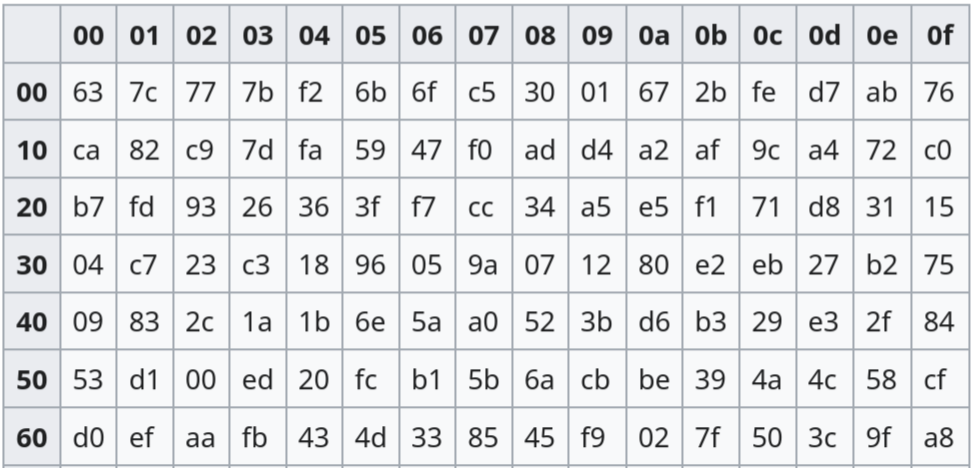

# Side Channel Analysis

## 1. Problem badawczy

Czy techniki uczenia maszynowego są w stanie przełamać zabezpieczenie typu *masking* w **SCA**? 

**SCA** (*Side Channel Analysis*) to klasa ataków kryptoanalitycznych, która ignoruje matematyczną siłę algorytmu, a zamiast tego atakuje jego fizyczną implementację.

## 2. Cel

Pola elektromagnetyczne emitowane przez mikrokontroler jest skorelowane z wagą Hamminga aktualnie przetwarzanych danych.

Celem ataku jest pozyskanie klucza, którego kontroler używa do szyfrowania danych, na podstawie zmierzonych wartości pola.

## 3. Dane

W projekcie wykorzystuję zbiór danych [ASCAD](https://github.com/ANSSI-FR/ASCAD), zawierający próbki pochodzące z mikrokontrolera ATMega8515 wykonującego szyfrowanie algorytmem AES.

## 4. S-box

Funkcja S-box to pierwsza nieliniowa operacja w algorytmie AES. Polega ona na podmianie bajtu tekstu jawnego $d$, zmieszanego z bajtem klucza $k$, na podstawie ustalonej tabeli podstawień:

$$
z = \mathrm{Sbox}(d \oplus k)
$$

 
*Rys. 3: Lookup table [[1](https://en.wikipedia.org/wiki/Rijndael_S-box)]*

Celujemy w operację S-box, ponieważ jest to punkt, w którym klucz jest po raz pierwszy bezpośrednio mieszany z danymi wejściowymi. Nieliniowość tej operacji ułatwia statystyczne odróżnienie poprawnego klucza od błędnego.

## 5. Atak

W modelu ataku zakłada się, że każdy pomiar jest niezależny. Całkowite prawdopodobieństwo (wiarygodność) dla danego kandydata na klucz $k \in \{0, 1, \dots, 255\}$ jest iloczynem prawdopodobieństw dla każdego zarejestrowanego śladu $t_i$

$$
P(T|k) = \prod_{i=1}^N P(t_i|k)
$$