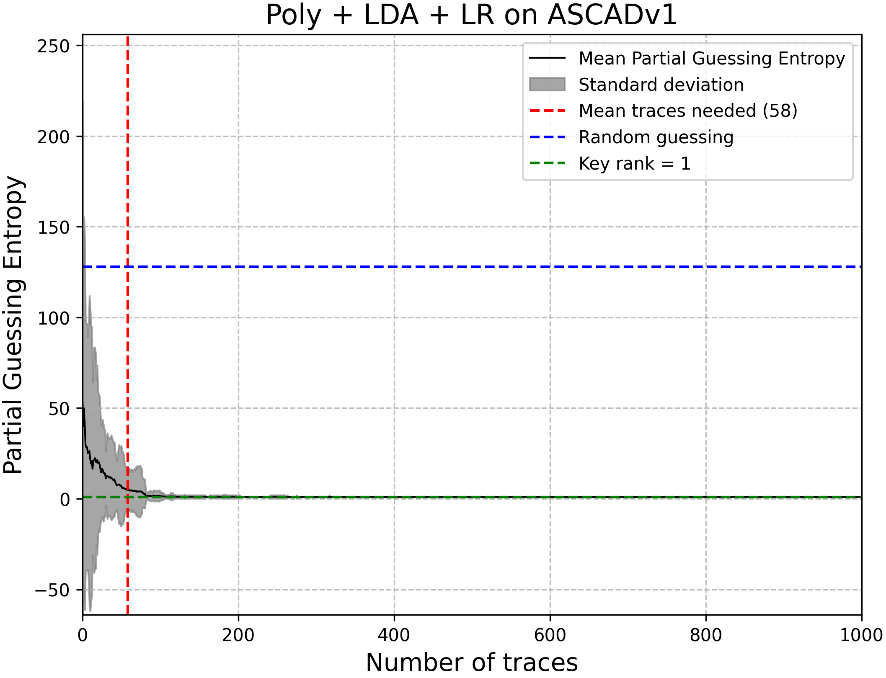

#### Celem projektu było zbadanie jak dobre wyniki da się osiągnąć przy użyciu klasycznych metod ML na datasecie [ASCAD v1 variable-key](https://github.com/ANSSI-FR/ASCAD/tree/master/ATMEGA_AES_v1/ATM_AES_v1_variable_key) (najpopularniejszy benchmark do Side-Channel Analysis). 

W folderze `notebooks/` znajdują się wszystkie notebooki potrzebne do mojej prezentacji, w `figures/` są wszystkie wygenerowane rysunki, `scripts/` zawiera kod używany przeze mnie do ewualuacji, robienia wykresów, utilsy, etc. Dodatkowo w `nn/` są modele DL (MLP), a w `trash/` nieudane/niedokończone eksperymenty.

### Instalacja

Cały kod był wykonywany w Pythonie 3.14.2. Do zainstalowania używanych pakietów: 
```{bash}
pip install -r requirements.txt
```

Aby pobrać dane do `data/processed/`:
```{bash}
python -m scripts.download
```

Opcjonalnie (aby wykonać notebooki):
```{bash}
python -m scripts.download -d v1/variable/desync0.h5 -o data/raw/ASCADv.h5
```

### Ewaluacja

Kod (również notebooki) przewidziany jest do opalania z poziomu repo, a skrypty powinny być odpalane jako moduły (`python -m ...`). W szczególności wykonanie:
```{bash}
python -m scripts.evaluate
```
Dokonuje walidacji krzyżowej na ostatecznym modelu i powinno wyświetlić poniższy wykres: 

oraz zapisać go jako `figures/09_pl_ascadv1.png`


