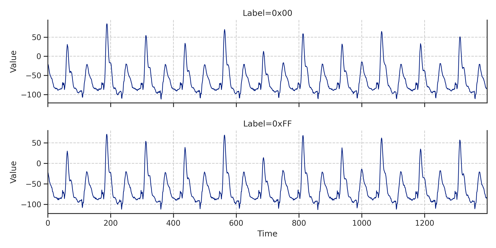

# Wprowadzenie do datasetu ASCAD v1

*Fig. 1: Schemat stanowiska pomiarowego [[1](https://www.researchgate.net/publication/372602727_PG-CAS_Pro-Active_EM-SCA_Probe_Detection_using_Switched-Capacitor_based_Patterned-Ground_Co-planar_Capacitive_Asymmetry_Sensing)].*

Surowe dane zawierają 100 000 próbek. Użyta przeze mnie wersja to wycięte *okno zainteresowania* (tzw. *ślad* o długości 700 próbek), w którym procesor wykonuje operację S-box. Zbiór ten jest powszechnie stosowany jako benchmark dla modeli uczenia głębokiego, jednak celem mojego projektu jest weryfikacja wyników osiągalnych przy użyciu klasycznego uczenia maszynowego.

Każda próbka w śladzie reprezentuje amplitudę pola elektromagnetycznego zmierzoną oscyloskopem w konkretnym cyklu zegara procesora (wartości znormalizowane w zakresie od -128 do 127).

*Fig. 2: Przykładowe ślady*

## S-box

Funkcja S-box to pierwsza nieliniowa operacja w algorytmie AES. Polega ona na podmianie bajtu tekstu jawnego $d$, zmieszanego z bajtem klucza $k$, na podstawie ustalonej tabeli podstawień:

$$
z = \mathrm{Sbox}(d \oplus k)
$$

*Rys. 3: Lookup table [[1](https://en.wikipedia.org/wiki/Rijndael_S-box)]*

Celujemy w operację S-box, ponieważ jest to punkt, w którym klucz jest po raz pierwszy bezpośrednio mieszany z danymi wejściowymi. Nieliniowość tej operacji ułatwia statystyczne odróżnienie poprawnego klucza od błędnego.

## Maskowanie

W celu utrudnienia ataku mikrokontroler stosuje metodę zwaną *maskingiem*. Polega ona na dodaniu losowej maski $r_{in}$ do wartości $d \oplus k$ i skonstruowaniu tymczasowej tabeli $\mathrm{Sbox}'$, która ma za zadanie kompensować maskę $r_{in}$ na wejściu i dodać nową losową maskę $r_{out}$ na wyjściu:

$$
z' = \mathrm{Sbox}'((d \oplus k) \oplus r_{in}) \oplus r_{out}
$$

Dzięki temu zabiegowi zarówno szyna adresowa, jak i szyna danych są zabezpieczone, ponieważ z punktu widzenia zewnętrznego obserwatora wartości te wyglądają jak prawie losowy szum. Ani niezemaskowana wartość $d \oplus k$, ani czysty wynik $z$ nie pojawiają się w żadnym momencie w rejestrze procesora.

---
